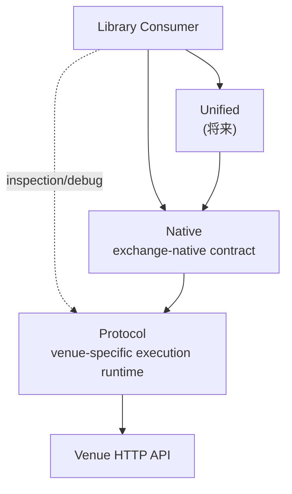
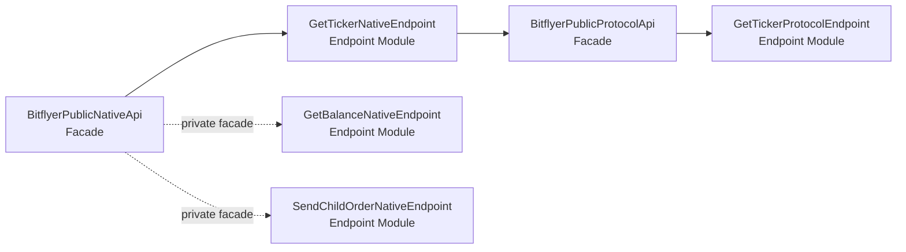
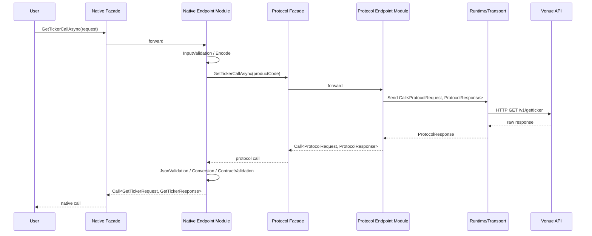

# Stage10 Spec（library 設計正本）

最終更新: 2026-03-24  
対象ブランチ: `stage10`

## 1. 位置づけ

本書は、Stage10 の設計を既存試作や旧文書の都合から切り離して整理し直した、現行の設計正本である。  
本書は `Facade + Endpoint Module` を前提に、今後の実装方針をまっさらな設計として定義する。

本書では、以下を明確に分離する。

- 設計正本
- 実装上の暫定事情
- 既存コードからの流用可能部品

本 repository は Stage10 の再構築対象であり、現行ブランチには source / tests / solution 構成が含まれてよい。  
必要であれば git history から過去実装を参照してよい。  
ただし、過去実装や現行実装は設計判断の正本ではなく、本書へ寄せるための参考材料として扱う。

### 1.1 文書統治

Stage10 における文書の主従は以下とする。

- [`docs/spec.md`](/home/tkoba/dev/tkoba0410/ExchangeAPI/docs/spec.md)
  - 設計正本
  - 層モデル、依存規約、error 契約、test 契約、変更ポリシーを定義する
- [`docs/endpoints-bitflyer.md`](/home/tkoba/dev/tkoba0410/ExchangeAPI/docs/endpoints-bitflyer.md)
  - bitFlyer の endpoint 運用正本
  - bitFlyer endpoint ごとの metadata と固定状況を定義する
- [`docs/endpoints-binance.md`](/home/tkoba/dev/tkoba0410/ExchangeAPI/docs/endpoints-binance.md)
  - Binance の endpoint 運用正本
  - Binance endpoint ごとの metadata と固定状況を定義する
- [`docs/cli.md`](/home/tkoba/dev/tkoba0410/ExchangeAPI/docs/cli.md)
  - CLI adapter の設計補助文書
  - library surface の利用方針と CLI 固有契約を定義する
- [`docs/mcp-server.md`](/home/tkoba/dev/tkoba0410/ExchangeAPI/docs/mcp-server.md)
  - MCP Server adapter の設計補助文書
  - `Unified` との関係と tool 公開方針を定義する

`docs/spec.md` と venue ごとの matrix を Stage10 library の正本とする。  
`Cli` と `McpServer` は別文書とし、本書では library から見た境界だけを扱う。  
本 repository では、library 設計の正本を `docs/spec.md` と venue matrix に固定し、削除済み inventory や補助文書を前提にしない。  
旧 `stage10b.md` は廃止し、現行の設計判断、運用判断、実装判断の根拠に使わない。

## 2. ゴール

- venue ごとの `Protocol` / `Native` client を、同一の Stage10 規約で追加できるようにする
- まず bitFlyer を完成させ、その後に Binance のような追加 venue を同じ型で載せる
- 公開面は `Facade`、実装単位は `Endpoint Module` とする
- `Native` を取引所横断正規化層ではなく、exchange-native contract 層として固定する
- `Unified` は「最小公約数」ではなく、「意味同一性を保証できる capability だけを公開する層」として定義する
- `Native` と `Unified` は層としては分離しつつ、利用者公開面では sibling surface として提示できるようにする
- `Unified` を将来追加できるよう、層名と責務境界を先に固定する
- 外部 adapter (`Cli` / `McpServer`) を library 正本と分離した文書体系で追加できるようにする
- 既存試作の file 配置に引っ張られず、責務境界から物理構成を決める

## 2.1 全体図

### 層構造



### Facade + Endpoint Module



### 1 endpoint の処理流れ



### 物理構成イメージ

```text
src/Exchanges/Bitflyer/
  Protocol/
    Public/Api/
    Public/Endpoints/<EndpointName>/
    Private/Api/
    Private/Endpoints/<EndpointName>/
    Internal/Auth/
    Internal/Runtime/
    Internal/Shared/
  Native/
    Public/Api/
    Public/Endpoints/<EndpointName>/
    Private/Api/
    Private/Endpoints/<EndpointName>/
    Internal/Shared/
  Composition/
  Vocabulary/
```

## 3. 層モデル

### 3.1 Protocol

`Protocol` は venue 固有の実行基盤である。

責務:

- HTTP 実行
- 認証
- 署名
- base URI
- transport 設定
- endpoint-level API
- canonical request の保持
- raw response の返却
- timeout / cancellation の伝播

責務に含めないもの:

- request DTO
- response DTO
- JSON decode
- ContractValidation
- automatic retry
- automatic rate limiting
- 取引所横断抽象化

公開面は facade とし、各 endpoint の送信実装は独立 endpoint module に切り出す。

追加原則:

- Stage10 の `Protocol` は 1 回の送信実行を正本とする
- retry / rate limiting / circuit breaker は既定責務に含めない
- 必要な場合でも `Protocol` の外側、または明示 opt-in の policy として扱う

### 3.2 Native

`Native` は exchange-native contract 層である。  
取引所横断正規化層ではない。

責務:

- request DTO
- response DTO
- request validation
- request encode
- `Protocol` 呼び出し
- response の `JsonValidation -> Conversion -> ContractValidation`
- `Call<TRequest, TResponse>` の組み立て

責務に含めないもの:

- transport 所有
- auth / signing
- retry / fallback
- raw JSON の公開
- 取引所横断意味への統合

公開面は facade とし、各 endpoint の native contract 実装は独立 endpoint module に切り出す。

### 3.3 Unified

`Unified` は将来追加する取引所横断抽象化層である。  
Stage10 では実装対象外とする。

定義:

- `Unified` は、複数 venue 間で利用者意図・前提条件・副作用・結果解釈・主要エラー分類の意味同一性を保証できる capability のみを公開する
- 「似ている」だけでは `Unified` に載せない
- API 単位でも返り値単位でも意味同一性を保証できないものは `Unified` でサポートしない
- サポートしない機能や field は `Native` にのみ置く

前提:

- `Unified` は `Native` の上に載る
- `Native` は `Unified` の都合で歪めない
- 取引所横断の query / command / capability は `Unified` で初めて導入する
- `Unified` は venue ごとの差分吸収層ではあるが、意味の曖昧化や silent degrade を許容しない
- `Unified` で未対応の capability を `Native` へ暗黙 fallback してはならない

### 3.4 External Adapters

`Cli` と `McpServer` は本書の主正本対象ではない。  
それぞれの設計は別文書で定義する。

前提:

- library は adapter-specific 事情を所有しない
- external adapter は library の public surface または `Composition` を経由して library を利用する
- CLI の正本は [`docs/cli.md`](/home/tkoba/dev/tkoba0410/ExchangeAPI/docs/cli.md) に置く
- MCP Server の正本は [`docs/mcp-server.md`](/home/tkoba/dev/tkoba0410/ExchangeAPI/docs/mcp-server.md) に置く

### 3.5 依存規約

依存方向の正本は以下とする。

- `Protocol.Endpoints` -> `Protocol.Internal.Runtime` / `Protocol.Internal.Auth` / `Protocol.Internal.Shared` / `Vocabulary` / `Primitives`
- `Protocol.Api` -> `Protocol.Endpoints` の module interface または module 集約 object
- `Native.Endpoints` -> `Native.Internal.Shared` / `Vocabulary` / `Primitives` / 対応する `Protocol` endpoint interface
- `Native.Api` -> `Native.Endpoints` の module interface または module 集約 object
- `Unified` -> `Native`
- `Composition` -> concrete 実装を横断的に組み立ててよい唯一の場所

禁止事項:

- facade から runtime / signer / transport へ直接触れること
- endpoint module から sibling endpoint module を直接呼ぶこと
- `Native` から `Protocol.Internal.Runtime` の concrete 実装へ直接触れること
- external adapter から concrete endpoint / runtime / signer / transport へ直接触れること

## 4. 公開面

### 4.1 基本方針

- `Call` を唯一の返却形式とする
- facade は薄い forward に徹する
- facade は endpoint 固有ロジックを持たない
- endpoint 固有ロジックは endpoint module に置く

### 4.2 Client 生成単位

- `CreateProtocolClient(...)`
  - `ProtocolBundle` を返す
  - `Public` を必須で持つ
  - 認証付きなら `Private` も持つ
- `CreateNativeClient(...)`
  - `NativeBundle` を返す
  - `Native.Public` を必須で持つ
  - 認証付きなら `Native.Private` も持つ
  - 内部で利用する `Protocol` へアクセスできる

### 4.2.1 Facade Method Contract

- facade の主公開面は `*CallAsync(...)` とする
- `Protocol` facade は `Task<Call<ProtocolRequest, ProtocolResponse>>` を返す
- `Native` facade は `Task<Call<TRequest, TResponse>>` を返す
- `Call` を返さない ergonomic wrapper は Stage10 の必須要件に含めない
- ergonomic wrapper を将来追加する場合でも、`Call` を返す主 API を置き換えてはならない
- facade の命名例:
  - `GetTickerCallAsync(...)`
  - `GetBalanceCallAsync(...)`
  - `SendChildOrderCallAsync(...)`
  - `CancelChildOrderCallAsync(...)`

### 4.2.2 User-Facing Surface Rule

- 層の依存方向と、利用者にどう見せるかは分けて扱う
- `Unified` は内部では `Native` の上に載るが、利用者公開面では `Native` と sibling surface として提示してよい
- external adapter は `native` と `unified` を parallel な入口として提示してよい
- `Unified` 未対応の capability を、利用者に見えない形で `Native` へ自動切り替えしてはならない
- 利用者が venue 固有機能を必要とする場合は、明示的に `Native` を選ぶ

### 4.3 Public / Private

- 各層で `Public` / `Private` を分ける
- API 機能単位では facade を分割しない
- facade の内側だけを endpoint module 単位で分ける

### 4.4 Endpoint Module 契約

- `1 endpoint = 1 module class` を原則とする
- `1 module = 1 public entry method` を原則とする
- `Protocol` endpoint module の entry method 名は `SendAsync(...)` を基本とする
- `Native` endpoint module の entry method 名は `CallAsync(...)` を基本とする
- facade は module を受け取り、薄い forward のみを行う
- `Protocol` endpoint module は method / path / query / body / canonical request / send / raw status の保持を所有する
- `Native` endpoint module は request validation / request encode / protocol call / response decode / ContractValidation / native call 組み立てを所有する
- endpoint module は sibling endpoint の業務判断を持たない
- endpoint 固有 DTO と endpoint 固有 helper は同じ endpoint フォルダに置いてよい
- shared helper へ切り出してよいのは、複数 endpoint で再利用され、かつ endpoint identity に依存しないものに限る

### 4.5 Endpoint Interface Contract

Codex が endpoint module を生成する際の基本契約は以下とする。

```csharp
public interface INativeEndpoint<in TRequest, TResponse>
{
    Task<Call<TRequest, TResponse>> CallAsync(
        TRequest request,
        CancellationToken cancellationToken = default);
}
```

補足:

- `Protocol` endpoint に共通の `IProtocolEndpoint` は定義しない
- `Protocol` endpoint は endpoint ごとの interface を持つ
- `Protocol` endpoint は transport-ready scalar / primitive 引数を受けてよい
- `Native` endpoint は request DTO を受ける
- 例:

```csharp
public interface IGetTickerProtocolEndpoint
{
    Task<Call<ProtocolRequest, ProtocolResponse>> SendAsync(
        string? productCode,
        CancellationToken cancellationToken = default);
}
```

```csharp
public interface ISendChildOrderProtocolEndpoint
{
    Task<Call<ProtocolRequest, ProtocolResponse>> SendAsync(
        string bodyJson,
        CancellationToken cancellationToken = default);
}
```

### 4.6 Foundation Contracts

Stage10 の基盤契約は `Protocol` 語彙で定義する。

- `ProtocolRequest`
  - protocol 層の canonical request snapshot
  - 少なくとも `EndpointId` / `Method` / `Path` / `Query` / `BodyText` を持つ
  - request header は記録しない
- `ProtocolResponse`
  - protocol 層の raw response snapshot
  - 少なくとも `StatusCode` / `Headers` / `BodyText` を持つ
- `Call<TRequest, TResponse>`
  - Stage10 の唯一の返却契約
- `CallError`
  - `Transport` / `Http` / `Codec` / `Semantic` / `Mapping` を表す
- `CallMeta`
  - 観測語彙と child call 情報を保持する
- `Unit`
  - successful response body が空であることを表す native response marker

追加原則:

- `ProtocolRequest` / `ProtocolResponse` は Stage10 の設計正本に属する
- lower-level HTTP client や runtime 実装は、必要なら内部で別型を使ってよい
- ただし facade と endpoint module の公開契約では `ProtocolRequest` / `ProtocolResponse` を正本にする

最低 shape:

```csharp
public sealed class ProtocolRequest
{
    public required string EndpointId { get; init; }
    public required string Method { get; init; }
    public required string Path { get; init; }
    public IReadOnlyDictionary<string, string>? Query { get; init; }
    public string? BodyText { get; init; }
}

public sealed class ProtocolResponse
{
    public required int StatusCode { get; init; }
    public IReadOnlyDictionary<string, string[]>? Headers { get; init; }
    public string? BodyText { get; init; }
}

public sealed class CallError
{
    public required string Kind { get; init; }
    public required string Message { get; init; }
}

public sealed class CallMeta
{
    public required string Layer { get; init; }
    public required string Component { get; init; }
    public required string EndpointId { get; init; }
    public required string Scope { get; init; }
    public required string Auth { get; init; }
    public IReadOnlyList<object>? Children { get; init; }
}

public readonly struct Unit
{
}

public sealed class Call<TRequest, TResponse>
{
    public required TRequest Request { get; init; }
    public required TResponse? Response { get; init; }
    public required bool IsSuccess { get; init; }
    public required CallError? Error { get; init; }
    public required CallMeta Meta { get; init; }
}
```

規約:

- `CallMeta.Children` は child call の保持場所として使う
- `Native` call の `Children` には、対応する single `Protocol` call を 1 件だけ入れる
- `ProtocolRequest.Headers` は持たない
- `ProtocolResponse.BodyText` は body 未返却時のみ `null` を許容する

## 5. Call と観測語彙

### 5.1 Call

- `Protocol` は `Task<Call<ProtocolRequest, ProtocolResponse>>` を返す
- `Native` は `Task<Call<TRequest, TResponse>>` を返す

`Call` の最低要件:

- `Request`
- `Response`
- `IsSuccess`
- `Error`
- `Meta`

追加原則:

- `Request` は常に非 `null`
- `Meta` は常に非 `null`
- success:
  - `IsSuccess = true`
  - `Response != null`
  - `Error = null`
- failure:
  - `IsSuccess = false`
  - `Response = null`
  - `Error != null`
- `Native` call は対応する `Protocol` call を child call として `Meta` 内に保持する
- `Protocol` call を持てない `Native` success / failure を作らない
- facade は `Call` を再構築せず、endpoint module が返した `Call` をそのまま返す

補足:

- `ProtocolRequest` / `ProtocolResponse` は Stage10 の基盤契約である
- lower-level transport 実装を再利用する場合でも、設計判断と公開契約は `Protocol` / `Native` 語彙で行う

### 5.2 CallMeta

`CallMeta.Layer` の基本語彙:

- `Protocol`
- `Native`
- `Composition`
- `Tests`

`CallMeta.Component` の基本語彙:

- `PublicFacade`
- `PrivateFacade`
- `PublicEndpointModule`
- `PrivateEndpointModule`
- `Transport`
- `Factory`
- `Bootstrap`

原則:

- facade が endpoint module の結果をそのまま返す場合、`Component` は module 側を優先する
- endpoint 名は `Component` に重ねず、`EndpointId` にのみ置く

### 5.3 観測と秘匿

- `CallMeta` には少なくとも `Layer` / `Component` / `EndpointId` / `Scope` / `Auth` を持たせる
- `Native` から `Protocol` を呼ぶ場合、child call を必ず保持する
- request header は記録しない
- API key / secret / 認証 header / 署名値は metadata や diagnostics に露出しない
- request body に秘匿値が含まれる endpoint でも、秘匿値そのものは diagnostics の正本にしない

### 5.4 Protocol Debug Logging

debug logging は `Protocol` 層にのみ許可する。

原則:

- 目的は debug 用に限定する
- `Native` / `Composition` / facade は raw request-response logging の正本を持たない
- request header は logging しない
- API key / secret / 認証 header / 署名値は logging しない
- logging は通常時 no-op を既定とする
- live test または明示 opt-in 実行時のみ有効化してよい

記録してよい項目:

- `EndpointId`
- `Method`
- `Path`
- query
- body text
- `StatusCode`
- response body text
- local timestamp

記録してはいけない項目:

- request headers
- response headers
- `ACCESS-KEY`, `ACCESS-TIMESTAMP`, `ACCESS-SIGN`
- API key / secret / signature payload

出力先:

- raw debug log は `local/logs/bitflyer/stage10/` 配下にのみ出力する
- raw debug log は `.gitignore` 対象とし、repository に commit / push しない

## 6. Request / Response 境界

### 6.1 Request

- `Native` は venue API の入力 field 集合を鏡像化した request DTO を受ける
- request DTO は path / query / body の配置を表現しない
- 配置決定は endpoint module 内の encoder が担う
- `null` は未指定を意味し、query / body / path に出力しない
- 必須項目欠落や組み合わせ不正は `Semantic`

### 6.2 Response

- `Protocol` は status / headers / raw JSON text を返す
- `Native` は raw JSON を native contract へ落とす
- response pipeline は `JsonValidation -> Conversion -> ContractValidation`
- 中間 JSON object は公開しない

### 6.3 Error 契約

`CallError.Kind` の解釈は以下を正本とする。

- `Transport`
  - DNS / socket / TLS / timeout / cancellation / send failure
  - HTTP response を受け取る前の失敗
- `Http`
  - non-success status
  - endpoint 固定の expected status 不一致
- `Codec`
  - response JSON parse 失敗
  - top-level shape 不一致
  - required raw field の欠落
  - `null` 不許可 field の `null`
  - scalar kind 不一致
  - timestamp / numeric parse 失敗
- `Semantic`
  - request DTO の必須項目欠落
  - request DTO の組み合わせ不正
  - raw shape は読めるが、API contract rule として不正
- `Mapping`
  - 鏡像 contract を超える明示的 mapping でのみ使う
  - Stage10 の初期 `Native` endpoint では原則として使わない

追加原則:

- `Protocol` は `Transport` を新規に生成してよい
- `Protocol` は HTTP response を受け取った時点で `ProtocolResponse` を返し、status code を `Http` へ変換しない
- `Protocol` は `Semantic` を新規に生成しない
- `Protocol` は `Codec` / `Mapping` を新規に生成しない
- `Native` の `Conversion` で起きる field-level decode failure は `Codec` とする
- `Native` の `ContractValidation` で起きる API contract rule violation は `Semantic` とする
- `Native` は transport failure を `Http` へ畳み込まない

### 6.4 API Contract Rule と Business Rule

- Stage10 の `Native` が扱うのは API contract rule までとする
- 例:
  - required field
  - mutually exclusive field
  - conditional required field
  - omission rule
  - expected status
- 取引戦略、資産判断、執行判断のような business rule は対象外とする

### 6.5 Validation Stage 語彙

- `JsonValidation`
  - parse、top-level shape、required raw field の存在確認を担う
- `Conversion`
  - raw JSON value を native value / candidate へ落とす
- `ContractValidation`
  - native candidate が API contract として成立するかを検証する
- `MeaningValidation` という語は Stage10 の正本語彙としては使わない

### 6.6 Private Auth / Signing 契約

bitFlyer private endpoint の認証・署名は `Protocol` が担う。

固定事項:

- 認証 header は `ACCESS-KEY`, `ACCESS-TIMESTAMP`, `ACCESS-SIGN`
- `ACCESS-TIMESTAMP` は Unix epoch milliseconds の decimal string
- 署名文字列は `timestamp + method + path + bodyText`
- query がある場合、`path` には query string を含める
- body がない場合、署名に使う bodyText は空文字列
- 署名算法は `HMACSHA256(secret, utf8(payload))` の lower-hex
- `Native` は署名を行わない
- `Native` は key / secret を知らない

## 7. Native Contract 方針

### 7.1 基本

- `Native` は exchange-native contract である
- venue API の field 集合を正本とした鏡像を原則とする
- PascalCase 化、型変換、nullable 化、serializer-native 化のみを許容する

### 7.2 命名

- field 名の唯一の語源は venue API の request / response field 名
- raw diagnostics 起源の property は持ち込まない

### 7.3 形状

- property-based immutable type を基本とする
- primary-constructor record は固定対象で採らない
- `JsonSerializer.Serialize(dto)` が既定設定で通る形を必須とする

### 7.4 非サポート

- `RawJson`
- `RawSnapshot`
- `Extras`
- custom key dictionary
- transport / diagnostics 型の公開露出

## 8. 物理構成

### 8.1 Protocol

```text
src/Exchanges/Bitflyer/Protocol/
  Public/
    Api/
      IBitflyerPublicProtocolApi.cs
      BitflyerPublicProtocolApi.cs
    Endpoints/
      GetTicker/
        GetTickerProtocolEndpoint.cs
  Private/
    Api/
      IBitflyerPrivateProtocolApi.cs
      BitflyerPrivateProtocolApi.cs
    Endpoints/
      GetBalance/
        GetBalanceProtocolEndpoint.cs
      SendChildOrder/
        SendChildOrderProtocolEndpoint.cs
      CancelChildOrder/
        CancelChildOrderProtocolEndpoint.cs
  Internal/
    Auth/
    Runtime/
    Shared/
```

ルール:

- facade は `Api/`
- endpoint 実装は `Endpoints/<EndpointName>/`
- shared helper だけ `Internal/Shared/`

### 8.2 Native

```text
src/Exchanges/Bitflyer/Native/
  Public/
    Api/
      IBitflyerPublicNativeApi.cs
      BitflyerPublicNativeApi.cs
    Endpoints/
      GetTicker/
        GetTickerNativeEndpoint.cs
        GetTickerRequest.cs
        GetTickerResponse.cs
  Private/
    Api/
      IBitflyerPrivateNativeApi.cs
      BitflyerPrivateNativeApi.cs
    Endpoints/
      GetBalance/
        GetBalanceNativeEndpoint.cs
        GetBalanceRequest.cs
        GetBalance.cs
      SendChildOrder/
        SendChildOrderNativeEndpoint.cs
        SendChildOrderRequest.cs
        SendChildOrderResponse.cs
      CancelChildOrder/
        CancelChildOrderNativeEndpoint.cs
        CancelChildOrderRequest.cs
  Internal/
    Shared/
```

ルール:

- endpoint 固有 encode / decode / validation は endpoint フォルダへ寄せてよい
- `Encoder` / `JsonValidation` / `Conversion` / `ContractValidation` / `Errors` は論理責務名であり、中央 top-level フォルダ固定を要求しない
- 複数 endpoint で再利用されるものだけ `Internal/Shared/` に残す

### 8.3 Composition

```text
src/Exchanges/Bitflyer/Composition/
  Bootstrap/
  Factory/
  Options/
```

責務:

- runtime 組み立て
- facade と endpoint module の配線
- shared 資源の所有権管理

非責務:

- endpoint 固有ロジック
- encode / decode / validation

### 8.4 Composition 配線規約

- shared runtime / signer / transport を先に組み立てる
- 次に `Protocol` endpoint module を組み立てる
- 次に `Protocol` facade を組み立てる
- 次に `Native` endpoint module を組み立てる
- 最後に `Native` facade を組み立てる
- facade constructor は unrelated helper を直接受け取らず、module interface または module 集約 object を受け取る
- concrete type を知ってよいのは `Composition` のみとする

### 8.5 Architecture Enforcement

Stage10 の規約は文書だけで終わらせず、arch test で機械検証する前提とする。

検証対象:

- `Protocol` から `Native` への参照禁止
- `Native` から `Protocol.Internal.Runtime` の concrete 実装への直接参照禁止
- facade から runtime / signer / transport への直接参照禁止
- endpoint module から sibling endpoint module への直接参照禁止
- concrete endpoint 実装型を知ってよい場所を `Composition` に限定する
- `Native` の公開面に `ProtocolResponse`、`JsonElement`、raw diagnostics 型を DTO 契約として露出しないこと
- `Protocol` の公開面は契約上 `ProtocolResponse` を返してよいが、`JsonElement` や raw diagnostics 型を露出しないこと

配置:

- `tests/Exchanges/Bitflyer/Architecture.Tests` を追加候補とする
- namespace forbidden dependency
- project reference forbidden edge
- public surface forbidden type
- file placement rule
  を機械検証対象に含めてよい

## 9. endpoint 運用正本

Stage10 の endpoint 運用正本は venue ごとの matrix とする。  
現時点の正本は以下。

- [`docs/endpoints-bitflyer.md`](/home/tkoba/dev/tkoba0410/ExchangeAPI/docs/endpoints-bitflyer.md)
- [`docs/endpoints-binance.md`](/home/tkoba/dev/tkoba0410/ExchangeAPI/docs/endpoints-binance.md)

本書は削除済み inventory や外部補助文書を前提にしない。

matrix が担うもの:

- 実装対象
- 公開対象
- DTO 固定状況
- live test 導入順

matrix が担わないもの:

- shared helper の配置
- converter / validator の file 粒度
- facade 内部の DI 配線

### 9.1 変更ポリシー

- 新しい endpoint は matrix 上 `Transitional` から開始する
- `Transitional -> Fixed` への更新条件は、文書更新、unit test、役割分離済み test、必要な live 検証の完了とする
- response field の additive 追加は、`Transitional` では保留してよい
- `Fixed` の request / response DTO を変更する場合は、文書、matrix、test を同時更新する
- alias path、expected status、optional omission rule を変更する場合は endpoint module test を更新する
- exchange 仕様差分を見つけた場合、まず `docs/spec.md` と matrix を更新し、その後実装を寄せる

### 9.2 Endpoint Metadata

venue ごとの endpoint matrix は、少なくとも以下の metadata を持つ。

- `EndpointId`
- `Method`
- `Path`
- `Scope`
- `ExposeInProtocol`
- `ExposeInNative`
- `LiveTestPhase`
- `RequestDtoStatus`
- `ResponseDtoStatus`
- `ExpectedStatus`
- `ResponseShape`
- `WritesState`
- `CleanupPolicy`
- `AliasPath`
- `AuthType`
- `OptionalOmissionRule`

各列の役割:

- `ExpectedStatus`
  - endpoint が成功と見なす status code を定義する
  - `Native` endpoint module が評価し、`Protocol` は raw status を保持する
- `ResponseShape`
  - `Object` / `Array` / `EmptyOrObject` など、top-level shape を定義する
- `WritesState`
  - venue state を変更する endpoint かどうかを示す
- `CleanupPolicy`
  - `None` / `Required` / `NotSupported` で write live test 時の cleanup 方針を示す
- `AliasPath`
  - canonical path 以外に `Protocol` が内部互換として許容する path を示す
- `AuthType`
  - `None` / `KeySecret` など、必要認証の型を示す
- `OptionalOmissionRule`
  - `null` や条件分岐で omission される query / body rule を簡潔に示す

原則:

- endpoint module 実装は matrix metadata に従う
- matrix へない metadata をコード側で暗黙導入しない
- metadata を増やす場合は `docs/spec.md` と matrix を同時更新する
- `ExposeInProtocol = Yes` の row では `ExpectedStatus` / `ResponseShape` / `AuthType` に `TBD` を残さない
- `ExposeInNative = Yes` の row では `ExpectedStatus` / `ResponseShape` / `AuthType` / `OptionalOmissionRule` に `TBD` を残さない
- `TBD` は `ExposeInProtocol != Yes` かつ `ExposeInNative != Yes` の row にのみ許容する

### 9.3 Compatibility / Versioning

`Native` contract の互換性方針は以下を正本とする。

- `Transitional`
  - DTO は変更可能
  - additive field 追加、property rename、shape 調整を許容する
  - 変更時は matrix と test を更新する
- `Fixed`
  - 既存 property の rename / remove / semantic change を禁止する
  - additive field 追加は、既存契約を壊さず serializer 契約と test を維持する場合に限り許容する
  - breaking change が必要な場合は、文書上で明示し、移行手順を先に定義する

追加原則:

- `Protocol` の `EndpointId` は alias path 変更で変えない
- canonical path の変更は breaking とみなす
- `ExpectedStatus`、`ResponseShape`、`AuthType` の変更は contract change として扱う
- 互換性判断はコード差分ではなく matrix metadata を基準に行う

## 10. 初期対象 endpoint

Stage10 で優先する endpoint:

- `GetTicker`
- `GetBalance`
- `SendChildOrder`
- `CancelChildOrder`

役割:

- `GetTicker`
  - public read の template
- `GetBalance`
  - private read と top-level array 契約の template
- `SendChildOrder`
  - private write と request encode の template
- `CancelChildOrder`
  - 注文 lifecycle 補助 endpoint の template

### 10.1 Test 契約

- `Protocol` endpoint module test
  - method / path / query / body / expected canonical request を検証する
  - transport failure と raw status の保持を検証する
- `Native` endpoint module test
  - request semantic rule
  - omission rule
  - response pipeline
  - expected status 判定
  - error kind 分類
  - nested `Protocol` call の保持
  を検証する
- facade test
  - thin forward だけを検証する
- composition test
  - bundle 構成と optional `Private` の有無だけを検証する
- read live test
  - `Protocol` raw response と `Native` DTO の parity を検証する
  - public は条件なしで実行する
  - private read は認証可能なときだけ実行する
- write live test
  - private write は認証可能かつ local marker file があるときだけ実行する
  - cleanup を含む
  - 同一 endpoint を `Protocol` と `Native` の parity で二重送信しない

### 10.2 Write Safety

state を変更する endpoint の live 実行には、以下を必須とする。

- public live test は常時実行対象とする
- private read live test は認証解決可能な場合のみ実行する
- private credentials は `age` file で供給する
  - `EXCHANGEAPI_BITFLYER_CREDENTIALS_AGE_FILE_PATH`
  - `EXCHANGEAPI_AGE_IDENTITY_FILE_PATH`
  - 2 つの file path はどちらも環境変数で明示指定する
- private write live test は認証解決可能であり、かつ local marker file がある場合のみ実行する
  - `local/bitflyer-live-write-enabled`
- 専用または影響を限定できる account を使う
- matrix 上 `CleanupPolicy = Required` の endpoint は cleanup 手順を同じ test に含める
- matrix 上 `CleanupPolicy = NotSupported` の endpoint は Stage10 の write live test 対象に含めない
- write test は最小数量、最小影響の request を使う
- `SendChildOrder` のような endpoint は `Protocol` と `Native` の parity 実行で二重送信しない
- cleanup 用 endpoint がある場合は acceptance id / order id を保持し、後続 cleanup を必ず試みる
- cleanup 失敗は silent ignore しない
- write live test は read parity test と別 phase で実行する

### 10.3 Live Debug Logging

live test で `Protocol` debug logging を使う場合は、以下を正本とする。

- 現行 phase では live test の debug logging は env で切り替えない
- raw log 出力先は `local/logs/bitflyer/stage10/`
- raw log は test 実行ごとに local のみへ出力する
- raw log 自体は repository artifact にしない

### 10.4 Artifact Generation Policy

repository に残す live artifact は、local raw log から生成した sanitize 済み artifact のみとする。

原則:

- raw debug log は commit しない
- repository に残す artifact は deterministic であること
- artifact は redacted 済みであること
- artifact 生成は local raw log を入力に行う

artifact に含めてよい項目:

- test name
- `EndpointId`
- `Method`
- `Path`
- query
- body text
  - 秘匿値を含まない範囲
- `StatusCode`
- response body text
- 実行 timestamp
- 判定結果

artifact に含めてはいけない項目:

- request headers
- response headers
- API key / secret
- 認証 header
- 署名値
- raw local filesystem path

## 11. 過去実装の扱い

### 11.1 正本にしないもの

- git history 上の file 配置
- `partial` 前提の facade 実装
- facade に endpoint 実装を直接生やす構成
- `Native` の validation 実装を中央集約フォルダ構成の正本として扱うこと

### 11.2 流用してよいもの

- transport
- signer
- runtime
- DTO 契約
- encoder / converter / validator の中身
- test assertion
- live test 基盤

### 11.3 判断原則

- 過去コードの場所ではなく、新しい責務境界を優先する
- 「そのまま残せるか」ではなく「新しい endpoint module へ安全に移せるか」で流用可否を判断する

## 12. Blank-Slate Bootstrap

blank slate から実装を再開する際は、以下を最初に作る。

```text
src/Exchanges/Bitflyer/
  Protocol/
  Native/
  Composition/
  Vocabulary/
tests/Exchanges/Bitflyer/
  Protocol.Tests/
  Native.Tests/
  Composition.Tests/
  LiveTests/

src/Exchanges/Binance/
  Protocol/
  Native/
  Composition/
  Vocabulary/
tests/Exchanges/Binance/
  Protocol.Tests/
  Native.Tests/
  Composition.Tests/
  LiveTests/
```

原則:

- venue ごとに `Protocol` / `Native` / `Composition` の 3 project を作る
- 次に `Protocol.Tests` / `Native.Tests` / `Composition.Tests` を作る
- `LiveTests` は read endpoint の parity が通ってから追加する
- `ExchangeApi.slnx` は上記 project を追加するまで空のままでよい

### 12.1 Bootstrap Manifest

最初に作る project と root namespace は以下で固定する。

```text
src/Exchanges/Bitflyer/Protocol/ExchangeApi.Exchanges.Bitflyer.Protocol.csproj
  RootNamespace: ExchangeApi.Exchanges.Bitflyer.Protocol

src/Exchanges/Bitflyer/Native/ExchangeApi.Exchanges.Bitflyer.Native.csproj
  RootNamespace: ExchangeApi.Exchanges.Bitflyer.Native

src/Exchanges/Bitflyer/Composition/ExchangeApi.Exchanges.Bitflyer.Composition.csproj
  RootNamespace: ExchangeApi.Exchanges.Bitflyer.Composition

tests/Exchanges/Bitflyer/Protocol.Tests/ExchangeApi.Exchanges.Bitflyer.Protocol.Tests.csproj
  RootNamespace: ExchangeApi.Tests.Exchanges.Bitflyer.Protocol.Tests

tests/Exchanges/Bitflyer/Native.Tests/ExchangeApi.Exchanges.Bitflyer.Native.Tests.csproj
  RootNamespace: ExchangeApi.Tests.Exchanges.Bitflyer.Native.Tests

tests/Exchanges/Bitflyer/Composition.Tests/ExchangeApi.Exchanges.Bitflyer.Composition.Tests.csproj
  RootNamespace: ExchangeApi.Tests.Exchanges.Bitflyer.Composition.Tests

tests/Exchanges/Bitflyer/LiveTests/ExchangeApi.Exchanges.Bitflyer.LiveTests.csproj
  RootNamespace: ExchangeApi.Tests.Exchanges.Bitflyer.LiveTests

src/Exchanges/Binance/Protocol/ExchangeApi.Exchanges.Binance.Protocol.csproj
  RootNamespace: ExchangeApi.Exchanges.Binance.Protocol

src/Exchanges/Binance/Native/ExchangeApi.Exchanges.Binance.Native.csproj
  RootNamespace: ExchangeApi.Exchanges.Binance.Native

src/Exchanges/Binance/Composition/ExchangeApi.Exchanges.Binance.Composition.csproj
  RootNamespace: ExchangeApi.Exchanges.Binance.Composition

src/Exchanges/Binance/Vocabulary/ExchangeApi.Exchanges.Binance.Vocabulary.csproj
  RootNamespace: ExchangeApi.Exchanges.Binance.Vocabulary

tests/Exchanges/Binance/Protocol.Tests/ExchangeApi.Exchanges.Binance.Protocol.Tests.csproj
  RootNamespace: ExchangeApi.Tests.Exchanges.Binance.Protocol.Tests

tests/Exchanges/Binance/Native.Tests/ExchangeApi.Exchanges.Binance.Native.Tests.csproj
  RootNamespace: ExchangeApi.Tests.Exchanges.Binance.Native.Tests

tests/Exchanges/Binance/Composition.Tests/ExchangeApi.Exchanges.Binance.Composition.Tests.csproj
  RootNamespace: ExchangeApi.Tests.Exchanges.Binance.Composition.Tests

tests/Exchanges/Binance/LiveTests/ExchangeApi.Exchanges.Binance.LiveTests.csproj
  RootNamespace: ExchangeApi.Tests.Exchanges.Binance.LiveTests
```

project reference の正本:

- `Native` -> `Protocol`
- `Composition` -> `Protocol`, `Native`
- `Protocol.Tests` -> `Protocol`
- `Native.Tests` -> `Native`, `Protocol`
- `Composition.Tests` -> `Composition`, `Protocol`, `Native`
- `LiveTests` -> `Composition`, `Protocol`, `Native`

venue-specific `Vocabulary` project を作る場合の正本:

- `Protocol` -> `Vocabulary`
- `Native` -> `Vocabulary`, `Protocol`
- `Composition` -> `Vocabulary`, `Protocol`, `Native`

## 13. 実装順

1. 文書を正本として固定する
2. `Protocol` の `GetTicker` を facade + endpoint module に移す
3. `Native` の `GetTicker` を同じ形へ移す
4. `GetBalance` を移す
5. `SendChildOrder` を移す
6. `CancelChildOrder` を移す
7. module 集約 object を導入して facade constructor を整理する
8. `Composition` を更新する
9. test を facade / endpoint module / composition に役割分離する
10. `partial` 依存構成と不要 helper を整理する

### 13.1 Codex 実装戦略

Codex は以下の順で実装する。

1. endpoint metadata を確認する
2. `Protocol` endpoint module を生成する
3. `Native` DTO を生成する
4. `Native` endpoint module を生成する
5. facade forwarding method を生成する
6. `Composition` で配線する
7. endpoint test / facade test / composition test を追加する

## 14. DoD

- `Protocol` / `Native` の責務境界が明確
- facade と endpoint module の役割分担が明確
- 文書統治が定義され、`docs/spec.md` と matrix の主従が固定されている
- 依存規約が文書化され、破ってよい場所が `Composition` に限定されている
- architecture enforcement の対象が明記されている
- facade の主公開面が `*CallAsync(...)` に固定されている
- `Call` の最低要件と nested `Protocol` call が定義されている
- error kind の使い分けが固定されている
- `Transport` / `Http` / `Codec` / `Semantic` / `Mapping` の境界が定義されている
- `Protocol` endpoint に共通 interface を置かず、endpoint-specific interface を使う方針が定義されている
- `Call` の success / failure 不変条件が定義されている
- `Native` が API contract rule までを扱い、business rule を持たないことが定義されている
- validation stage 語彙が本書に従っている
- test の役割分担が固定されている
- endpoint metadata の必須列が定義されている
- 公開対象 row に `TBD` を残さない規則が定義されている
- compatibility / versioning 方針が定義されている
- write safety 規約が定義されている
- `Native` が exchange-native contract として定義されている
- `Unified` の意味同一性ルールが定義されている
- library と external adapter の境界が定義されている
- `Unified` を上位層として追加できる
- endpoint 運用正本が venue ごとの `docs/endpoints-<venue>.md` に固定されている
- 既存試作は移行材料であって設計正本ではないことが明記されている

## 15. Out of Scope

- 取引所横断 DTO
- 取引所横断 capability
- `Unified` の実装
- `McpServer` の実装
